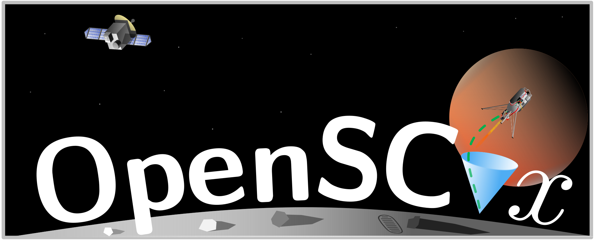

<a id="readme-top"></a>


<p align="center">
    <a href="https://github.com//haynec/OpenSCvx/actions/workflows/main.yml/badge.svg"></a>
    <a href="https://arxiv.org/abs/2410.22596"></a>
    <a href="https://www.apache.org/licenses/LICENSE-2.0"></a>
</p>

<!-- PROJECT LOGO -->
<br />

<!-- GETTING STARTED -->
## Getting Started


### Installation
The main packages are:
- ```cvxpy``` - is used to formulation and solve the convex subproblems
- ```jax``` - is used for determining the Jacobians using automatic differentiation, vectorization, and ahead-of-time (AOT) compilation of the dynamics and their Jacobians 
- ```numpy``` - is used for numerical operations
- ```scipy``` - is used for the numerical integration of the dynamics
- ```pyaml```  - is used for reading the configuration files
- ```termcolor``` - is used for pretty command line output
- ```plotly``` - is used for all visualizations


These can be installed via conda or pip.
<details>
<summary>Via Conda (Recommended) </summary>

1. Clone the repo
   ```sh
   git clone https://github.com/haynec/OpenSCvx.git
   ```
2. Install environment packages (this will take about a minute or two):
   ```sh
   conda env create -f environment.yml
   ```
3. Activate the environment:
   ```sh
   conda activate los_guidance
   ```

</details>

<details>
<summary>Via Pip</summary>

0. Prerequisites
   Python >= 3.9
1. Clone the repo
   ```sh
   git clone https://github.com/haynec/OpenSCvx.git
   ```
2. Install environment packages:
   ```sh
   pip install -r requirements.txt
   ```
</details>

### Running Trajectory Optimization

See `examples/` folder for several example trajectory optimization problems.
To run a problem simply run `examples/main.py` with:

```bash
python3 -m examples.main
```

To change which example is run by `main` simply replace the `params` import line:

```python
# other imports
from examples.params.dr_vp import params
# rest of code
```

Check out the problem definitions inside `examples/params` to see how to define your own problems.


## ToDos
- [X] Standardized Vehicle and Constraint classes
- [X] Implement QOCOGen with CVPYGEN
- [X] Non-Dilated Time Propagation 
- [ ] Linear vs. Nonlinear Cost Trust Region Update
- [ ] Auto-SCvx Weight Tuning
- [ ] Compiled at the subproblem level with JAX
## What is implemented
This repo has the following features:
1. Free Final Time
2. Fully adaptive time dilation (s is appended to the control vector)
3. Continuous-Time Constraint Satisfaction
4. FOH and ZOH exact discretization
6. Vectorized and Ahead-of-Time (AOT) Compiled Multishooting Discretization
7. JAX Autodiff for Jacobians

<p align="right">(<a href="#readme-top">back to top</a>)</p>


## Acknowledgements
This work was supported by a NASA Space Technology Graduate Research Opportunity and the Office of Naval Research under grant N00014-17-1-2433. The authors would like to acknowledge Natalia Pavlasek, Griffin Norris, Samuel Buckner, Abhi Kamath, Govind Chari, and Purnanand Elango as well as the other Autonomous Controls Laboratory members, for their many helpful discussions and support throughout this work.

## Citation
Please cite the following works if you use the repository,
```
@ARTICLE{hayner2025los,
        author={Hayner, Christopher R. and Carson III, John M. and Açıkmeşe, Behçet and Leung, Karen},
        journal={IEEE Robotics and Automation Letters}, 
        title={Continuous-Time Line-of-Sight Constrained Trajectory Planning for 6-Degree of Freedom Systems}, 
        year={2025},
        volume={},
        number={},
        pages={1-8},
        keywords={Robot sensing systems;Vectors;Vehicle dynamics;Line-of-sight propagation;Trajectory planning;Trajectory optimization;Quadrotors;Nonlinear dynamical systems;Heuristic algorithms;Convergence;Constrained Motion Planning;Optimization and Optimal Control;Aerial Systems: Perception and Autonomy},
        doi={10.1109/LRA.2025.3545299}}
```

```
@misc{elango2024ctscvx,
      title={Successive Convexification for Trajectory Optimization with Continuous-Time Constraint Satisfaction}, 
      author={Purnanand Elango and Dayou Luo and Abhinav G. Kamath and Samet Uzun and Taewan Kim and Behçet Açıkmeşe},
      year={2024},
      eprint={2404.16826},
      archivePrefix={arXiv},
      primaryClass={math.OC},
      url={https://arxiv.org/abs/2404.16826}, 
}
```


<!-- MARKDOWN LINKS & IMAGES -->
<!-- https://www.markdownguide.org/basic-syntax/#reference-style-links -->
[contributors-shield]: https://img.shields.io/github/contributors/haynec/los_guidance.svg?style=for-the-badge
[contributors-url]: https://github.com/haynec/los_guidance/graphs/contributors
[forks-shield]: https://img.shields.io/github/forks/haynec/los_guidance.svg?style=for-the-badge
[forks-url]: https://github.com/haynec/los_guidance/network/members
[stars-shield]: https://img.shields.io/github/stars/haynec/los_guidance.svg?style=for-the-badge
[stars-url]: https://github.com/haynec/los_guidance/stargazers
[issues-shield]: https://img.shields.io/github/issues/haynec/los_guidance.svg?style=for-the-badge
[issues-url]: https://github.com/haynec/los_guidance/issues
[license-shield]: https://img.shields.io/github/license/haynec/los_guidance.svg?style=for-the-badge
[license-url]: https://github.com/haynec/los_guidance/blob/master/LICENSE.txt
[linkedin-shield]: https://img.shields.io/badge/-LinkedIn-black.svg?style=for-the-badge&logo=linkedin&colorB=555
[linkedin-url]: https://linkedin.com/in/linkedin_username
[product-screenshot]: images/screenshot.png
[Next.js]: https://img.shields.io/badge/next.js-000000?style=for-the-badge&logo=nextdotjs&logoColor=white
[Next-url]: https://nextjs.org/
[React.js]: https://img.shields.io/badge/React-20232A?style=for-the-badge&logo=react&logoColor=61DAFB
[React-url]: https://reactjs.org/
[Vue.js]: https://img.shields.io/badge/Vue.js-35495E?style=for-the-badge&logo=vuedotjs&logoColor=4FC08D
[Vue-url]: https://vuejs.org/
[Angular.io]: https://img.shields.io/badge/Angular-DD0031?style=for-the-badge&logo=angular&logoColor=white
[Angular-url]: https://angular.io/
[Svelte.dev]: https://img.shields.io/badge/Svelte-4A4A55?style=for-the-badge&logo=svelte&logoColor=FF3E00
[Svelte-url]: https://svelte.dev/
[Laravel.com]: https://img.shields.io/badge/Laravel-FF2D20?style=for-the-badge&logo=laravel&logoColor=white
[Laravel-url]: https://laravel.com
[Bootstrap.com]: https://img.shields.io/badge/Bootstrap-563D7C?style=for-the-badge&logo=bootstrap&logoColor=white
[Bootstrap-url]: https://getbootstrap.com
[JQuery.com]: https://img.shields.io/badge/jQuery-0769AD?style=for-the-badge&logo=jquery&logoColor=white
[JQuery-url]: https://jquery.com 
