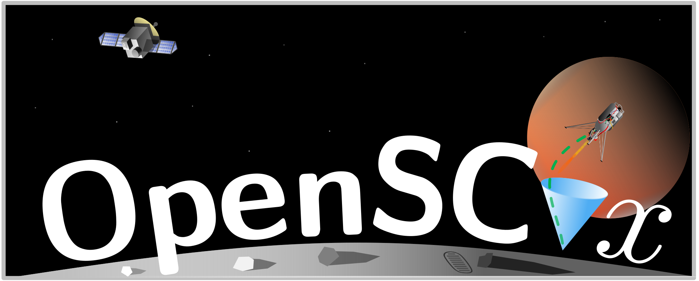

<a id="readme-top"></a>


<p align="center">
    <a href="https://github.com/OpenSCvx/OpenSCvx/actions/workflows/lint.yml"></a>
    <a href="https://github.com/OpenSCvx/OpenSCvx/actions/workflows/tests.yml"></a>
    <a href="https://github.com/OpenSCvx/OpenSCvx/actions/workflows/tests-examples.yml"></a>
    <a href="https://github.com/OpenSCvx/OpenSCvx/actions/workflows/nightly.yml"></a>
    <a href="https://github.com/OpenSCvx/OpenSCvx/actions/workflows/release.yml"></a>
</p>
<p align="center">
    <a href="https://arxiv.org/abs/2410.22596"></a>
    <a href="https://www.apache.org/licenses/LICENSE-2.0"></a>
</p>

<!-- PROJECT LOGO -->
<br />

## What is OpenSCvx

OpenSCvx is a general python-based successive convexification implementation which uses a JAX backend.
It is designed to be easy to use for anyone and fast enough for everyone, all while being open and modular for contributors.

OpenSCvx provides a clean symbolic interface for problem definition which should be intuitive to users of NumPy, JAX, and CVXPY. This allows us to hide a lot of the under-the-hood magic away from the user while also providing a modular architecture, enabling contributors to focus on the algorithms without worrying about interface design.

OpenSCvx makes heavy use of [JAX](https://github.com/jax-ml/jax) to efficiently perform calculations in the successive convex programming loop through automatic differentiation, ahead-of-time (AOT) compilation, vectorization, and GPU acceleration. Behind this is a [CVXPY](https://github.com/cvxpy/cvxpy/)-based backend to solve the convex subproblems.

This is an open project and is under active development. Try it out, give us feedback, and help contribute.

```python
import openscvx as ox

g = 9.81

# Define states
position = ox.State("position", shape=(2,))
position.min = [0.0, 0.0]
position.max = [10.0, 10.0]
position.initial = [0.0, 10.0]
position.final = [10.0, 5.0]

velocity = ox.State("velocity", shape=(1,))
velocity.min = [0.0]
velocity.max = [10.0]
velocity.initial = [0.0]
velocity.final = [ox.Free(10.0)]

# Define control (angle from vertical)
theta = ox.Control("theta", shape=(1,))
theta.min = [0.0]
theta.max = [1.755]
theta.guess = [[0.09], [1.755]]

# Define dynamics
dynamics = {
    "position": ox.Concat(
        velocity * ox.Sin(theta),
        -velocity * ox.Cos(theta),
    ),
    "velocity": g * ox.Cos(theta),
}

constraints = []
for state in [position, velocity]:
    constraints.append(ox.ctcs(state <= state.max))
    constraints.append(ox.ctcs(state.min <= state))

# Build and solve
problem = ox.Problem(
    dynamics=dynamics,
    constraints=constraints,
    states=[position, velocity],
    controls=[theta],
    time=ox.Time(initial=0.0, final=ox.Minimize(2.0), min=0.0, max=2.0),
    N=2,
)


problem.initialize()
results = problem.solve()
results = problem.post_process()
```

## Installation

OpenSCvx is available on [PyPI](https://pypi.org/project/openscvx/) and can be trivially installed with pip.

It is recommended to install OpenSCvx inside a virtual environment (venv, conda, uv, *etc.*). If you don't already have one set up:

```bash
python3 -m venv .venv
source .venv/bin/activate
```

### Using pip

```bash
pip install openscvx
```

### Using uv

If you have [uv installed](https://docs.astral.sh/uv/getting-started/installation/) you can prefix the commands with `uv` for faster installation:

```bash
uv pip install openscvx
```

> [!TIP]
> **Optional dependencies**
>
> For CVXPYGen code generation:
> ```bash
> pip install openscvx[cvxpygen]
> ```

> [!TIP]
> **Nightly Builds**
>
> To install the latest development version (nightly), use the `--pre` flag:
> ```bash
> pip install --pre openscvx
> ```

## Installing From Source

### Using pip

```bash
git clone https://github.com/OpenSCvx/OpenSCvx.git
cd OpenSCvx

python3 -m venv .venv
source .venv/bin/activate
pip install -e .
```

### Using uv

```bash
git clone https://github.com/OpenSCvx/OpenSCvx.git
cd OpenSCvx

uv venv
source .venv/bin/activate
uv pip install -e .
```

> [!NOTE]
> **MuJoCo Menagerie (optional submodule)**
>
> Core OpenSCvx installs fine from a plain clone—you do **not** need the submodule unless you want bundled [MuJoCo Menagerie](https://github.com/google-deepmind/mujoco_menagerie) assets. To fetch it in one step, clone with `--recurse-submodules`, or add it later to `third_party/mujoco_menagerie` so `openscvx.integrations.menagerie` can load those MuJoCo XML/models/meshes without a separate checkout:
>
> ```bash
> git clone --recurse-submodules https://github.com/OpenSCvx/OpenSCvx.git
> ```
>
> After a clone without submodules, initialize Menagerie whenever you need it:
>
> ```bash
> git submodule update --init third_party/mujoco_menagerie
> ```

## Documentation

Check out the OpenSCvx documentation:

- [Users Guide](https://openscvx.github.io/OpenSCvx/latest/UsersGuide/00_introduction/)
- [API Reference](https://openscvx.github.io/OpenSCvx/latest/Reference/)
- [Examples overview](https://openscvx.github.io/OpenSCvx/latest/examples/)

### Running the Examples

We also have a selection of problems in the `examples/` folder as well as on the [Examples page](https://openscvx.github.io/OpenSCvx/latest/Examples/abstract/brachistochrone/) of the documentation. The example trajectory optimization problems are grouped by application and represent some of the problem types that can be solved by OpenSCvx.

> [!Note]
> To run the examples, you'll need to clone this repository and install OpenSCvx in editable mode (`pip install -e .`). See the [Installing From Source](#installing-from-source) section above for detailed installation instructions.

To run a problem simply run any of the examples directly, for example:

```sh
python3 examples/abstract/brachistochrone.py
```

and adjust the plotting as needed.

Check out the problem definitions inside `examples/` to see how to define your own problems.

## Code Structure


## What is implemented

This repo has the following features:

1. Free Final Time
2. Fully adaptive time dilation (`s` is appended to the control vector)
3. Continuous-Time Constraint Satisfaction
4. FOH and ZOH exact discretization (`t` is a state so you can bring your own scheme)
6. Vectorized and Ahead-of-Time (AOT) Compiled Multishooting Discretization
7. JAX Autodiff for Jacobians

<p align="right">(<a href="#readme-top">back to top</a>)</p>

## Third-Party Integrations

OpenSCvx integrates with several optional third-party packages. Each installs as a pip extra (`pip install openscvx[<extra>]`); without it, the library and its tests degrade gracefully — the corresponding tests simply skip. Integrations with a badge are tested against `main` on every push and re-checked weekly against the latest upstream releases.

| Integration | Extra | Provides | Status |
| --- | --- | --- | --- |
| [MuJoCo MJX](https://mujoco.readthedocs.io/en/stable/mjx.html) | `mjx` | MJX dynamics adapter (`openscvx.integrations`) | [](https://github.com/OpenSCvx/OpenSCvx/actions/workflows/tests-mjx.yml) |
| [jaxlie](https://github.com/brentyi/jaxlie) | `lie` | SO(3)/SE(3) Lie-group operations and IK initialization | [](https://github.com/OpenSCvx/OpenSCvx/actions/workflows/tests-lie.yml) |
| [qpax](https://github.com/qpax-solver/qpax) | `qpax` | JAX-native QP solver backend | [](https://github.com/OpenSCvx/OpenSCvx/issues/550) |
| [CVXPYGen](https://github.com/cvxgrp/cvxpygen) | `cvxpygen` | Generated C solver code for the convex subproblem | [](https://github.com/OpenSCvx/OpenSCvx/issues/551) |
| [moreau](https://pypi.org/project/moreau/) | `moreau` | Licensed QP solver backend |  |
| [stljax](https://github.com/UW-CTRL/stljax) | `stl` | Signal Temporal Logic robustness bridge |  |
| [frax](https://github.com/danielpmorton/frax) | `frax` | Robot dynamics for the manipulator examples | [](https://github.com/OpenSCvx/OpenSCvx/actions/workflows/tests-examples.yml) |

<p align="right">(<a href="#readme-top">back to top</a>)</p>

## Acknowledgements

This work was supported by a NASA Space Technology Graduate Research Opportunity and the Office of Naval Research under grant N00014-17-1-2433. The authors would like to acknowledge Natalia Pavlasek, Fabio Spada, Samuel Buckner, Abhi Kamath, Govind Chari, and Purnanand Elango as well as the other Autonomous Controls Laboratory members, for their many helpful discussions and support throughout this work.

## Citation

Please cite the following works if you use the repository,

```tex
@ARTICLE{hayner2025los,
        author={Hayner, Christopher R. and Carson III, John M. and Açıkmeşe, Behçet and Leung, Karen},
        journal={IEEE Robotics and Automation Letters}, 
        title={Continuous-Time Line-of-Sight Constrained Trajectory Planning for 6-Degree of Freedom Systems}, 
        year={2025},
        volume={},
        number={},
        pages={1-8},
        keywords={Robot sensing systems;Vectors;Vehicle dynamics;Line-of-sight propagation;Trajectory planning;Trajectory optimization;Quadrotors;Nonlinear dynamical systems;Heuristic algorithms;Convergence;Constrained Motion Planning;Optimization and Optimal Control;Aerial Systems: Perception and Autonomy},
        doi={10.1109/LRA.2025.3545299}}
```

```tex
@misc{elango2024ctscvx,
      title={Successive Convexification for Trajectory Optimization with Continuous-Time Constraint Satisfaction}, 
      author={Purnanand Elango and Dayou Luo and Abhinav G. Kamath and Samet Uzun and Taewan Kim and Behçet Açıkmeşe},
      year={2024},
      eprint={2404.16826},
      archivePrefix={arXiv},
      primaryClass={math.OC},
      url={https://arxiv.org/abs/2404.16826}, 
}
```

```tex
@article{chari2026qoco,
  title = {QOCO: a quadratic objective conic optimizer with custom solver generation},
  author = {Chari, Govind M. and A\c{c}ıkmeşe, Beh\c{c}et},
  journal = {Mathematical Programming Computation},
  issn = {1867-2957},
  url = {http://dx.doi.org/10.1007/s12532-026-00311-8},
  doi = {10.1007/s12532-026-00311-8},
  publisher = {Springer Science and Business Media LLC},
  year = {2026},
  month = mar,
}
```
